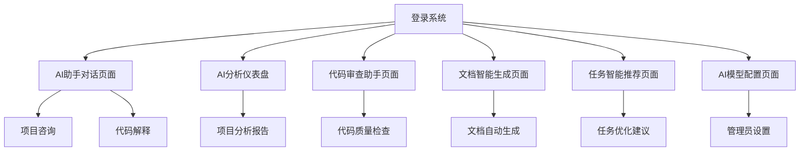

# AI模块产品需求文档

## 1. 产品概述

AI模块是一个集成到现有项目管理平台的智能助手系统，旨在通过人工智能技术提升团队协作效率和项目管理质量。该模块提供智能对话、代码分析、文档生成、任务推荐等核心功能，帮助用户更高效地完成项目开发和管理工作。

本模块将成为平台的核心竞争力，通过AI技术赋能传统项目管理，为用户提供更智能、更便捷的工作体验，预期将显著提升用户粘性和平台价值。

## 2. 核心功能

### 2.1 用户角色

| 角色 | 注册方式 | 核心权限 |
|------|----------|----------|
| 普通用户 | 现有用户系统自动获得 | 可使用基础AI对话、查看AI分析报告 |
| 项目管理员 | 项目权限升级 | 可配置项目AI设置、查看团队AI使用统计 |
| 系统管理员 | 系统权限分配 | 可管理AI模型配置、监控系统使用情况 |

### 2.2 功能模块

我们的AI模块需求包含以下主要页面：

1. **AI助手对话页面**：智能对话界面、历史记录管理、多轮对话支持
2. **AI分析仪表盘**：项目智能分析、数据可视化、趋势预测
3. **代码审查助手页面**：代码质量分析、安全漏洞检测、优化建议
4. **文档智能生成页面**：需求文档生成、技术文档创建、报告自动化
5. **任务智能推荐页面**：任务优先级建议、资源分配优化、进度预测
6. **AI模型配置页面**：模型参数设置、API配置管理、使用限制设定

### 2.3 页面详情

| 页面名称 | 模块名称 | 功能描述 |
|----------|----------|----------|
| AI助手对话页面 | 对话界面 | 提供智能对话功能，支持项目相关问题咨询、代码解释、技术方案建议等多种对话场景 |
| AI助手对话页面 | 历史记录 | 保存和管理用户对话历史，支持搜索、分类、导出等操作 |
| AI助手对话页面 | 上下文管理 | 维护对话上下文，支持项目文档、代码文件等资料的智能关联 |
| AI分析仪表盘 | 项目分析 | 分析项目进度、团队效率、风险预警等关键指标，生成智能报告 |
| AI分析仪表盘 | 数据可视化 | 展示项目数据的图表分析，包括燃尽图预测、工作量分布等 |
| AI分析仪表盘 | 趋势预测 | 基于历史数据预测项目完成时间、资源需求等关键信息 |
| 代码审查助手页面 | 代码分析 | 自动分析代码质量、性能问题、安全漏洞，提供详细的改进建议 |
| 代码审查助手页面 | 规范检查 | 检查代码是否符合团队编码规范，提供自动修复建议 |
| 代码审查助手页面 | 测试建议 | 分析代码覆盖率，建议需要补充的测试用例 |
| 文档智能生成页面 | 需求文档生成 | 基于项目信息和用户输入，自动生成标准化的需求文档 |
| 文档智能生成页面 | 技术文档创建 | 根据代码结构和注释，自动生成API文档、架构说明等技术文档 |
| 文档智能生成页面 | 模板管理 | 管理文档模板，支持自定义模板创建和共享 |
| 任务智能推荐页面 | 优先级建议 | 基于项目目标和资源情况，智能推荐任务优先级排序 |
| 任务智能推荐页面 | 资源分配 | 分析团队成员技能和工作负载，推荐最优的任务分配方案 |
| 任务智能推荐页面 | 进度预测 | 预测任务完成时间，识别潜在的延期风险 |
| AI模型配置页面 | 模型设置 | 配置AI模型参数、选择适合的模型版本、设置响应策略 |
| AI模型配置页面 | API管理 | 管理第三方AI服务的API密钥、调用限制、成本控制 |
| AI模型配置页面 | 使用统计 | 监控AI功能使用情况、成本分析、性能指标 |

## 3. 核心流程

### 普通用户流程
用户登录系统后，可以直接访问AI助手对话页面进行智能咨询。在项目管理过程中，用户可以查看AI分析仪表盘获取项目洞察，使用代码审查助手提升代码质量，通过文档智能生成功能快速创建各类文档，并参考任务智能推荐优化工作安排。

### 项目管理员流程
项目管理员除了拥有普通用户的所有功能外，还可以访问AI模型配置页面设置项目级别的AI参数，查看团队AI使用统计，配置AI功能的访问权限和使用限制。

### 系统管理员流程
系统管理员负责全局AI模型配置，包括API密钥管理、模型版本选择、系统级使用限制设定，同时监控整个系统的AI功能使用情况和成本控制。



## 4. 技术架构设计

### 4.1 技术栈选型

#### 4.1.1 核心AI框架
- **LangChain**: 作为AI应用开发的核心框架，提供统一的LLM接口、链式调用、记忆管理等功能
- **LangGraph**: 用于构建复杂的AI智能体工作流，支持状态管理、条件分支、循环处理等高级功能
- **LangSmith**: 用于AI应用的监控、调试和性能优化

#### 4.1.2 前端技术栈
- **Next.js 14**: 基于现有项目架构，支持App Router和Server Components
- **TypeScript**: 提供类型安全和更好的开发体验
- **Tailwind CSS + shadcn/ui**: 保持与现有项目的UI一致性
- **React Query/SWR**: 用于AI API调用的状态管理和缓存

#### 4.1.3 后端技术栈
- **Node.js + Express/Fastify**: API服务层
- **Prisma**: 数据库ORM，与现有项目保持一致
- **Redis**: 用于会话缓存和AI对话历史存储
- **WebSocket**: 实时AI对话和状态更新

### 4.2 LangChain架构设计

#### 4.2.1 核心组件架构
```
┌─────────────────────────────────────────────────────────────┐
│                    AI模块架构层次                              │
├─────────────────────────────────────────────────────────────┤
│  前端层 (Next.js)                                           │
│  ├── AI对话组件                                              │
│  ├── 代码分析组件                                            │
│  ├── 文档生成组件                                            │
│  └── 配置管理组件                                            │
├─────────────────────────────────────────────────────────────┤
│  API网关层 (Next.js API Routes)                            │
│  ├── /api/ai/chat - 对话接口                                │
│  ├── /api/ai/analyze - 分析接口                             │
│  ├── /api/ai/generate - 生成接口                            │
│  └── /api/ai/config - 配置接口                              │
├─────────────────────────────────────────────────────────────┤
│  LangChain服务层                                            │
│  ├── ChatChain - 对话链                                     │
│  ├── AnalysisChain - 分析链                                 │
│  ├── GenerationChain - 生成链                               │
│  └── MemoryManager - 记忆管理                               │
├─────────────────────────────────────────────────────────────┤
│  LangGraph工作流层                                          │
│  ├── CodeReviewAgent - 代码审查智能体                       │
│  ├── DocumentAgent - 文档生成智能体                         │
│  ├── TaskAgent - 任务推荐智能体                             │
│  └── AnalysisAgent - 项目分析智能体                         │
├─────────────────────────────────────────────────────────────┤
│  LLM提供商层                                                │
│  ├── OpenAI GPT-4/GPT-3.5                                  │
│  ├── Anthropic Claude                                      │
│  ├── 本地模型 (Ollama)                                      │
│  └── 自定义模型接口                                          │
└─────────────────────────────────────────────────────────────┘
```

#### 4.2.2 LangChain链式设计

**1. 智能对话链 (ChatChain)**
```typescript
// 对话链配置
const chatChain = new ConversationChain({
  llm: new ChatOpenAI({ temperature: 0.7 }),
  memory: new ConversationBufferWindowMemory({ k: 10 }),
  prompt: ChatPromptTemplate.fromMessages([
    SystemMessagePromptTemplate.fromTemplate(
      "你是一个专业的项目管理AI助手，具备代码分析、文档生成等能力..."
    ),
    new MessagesPlaceholder("history"),
    HumanMessagePromptTemplate.fromTemplate("{input}")
  ])
});
```

**2. 代码分析链 (CodeAnalysisChain)**
```typescript
// 代码分析链
const codeAnalysisChain = new SequentialChain({
  chains: [
    new LLMChain({
      llm: new ChatOpenAI({ model: "gpt-4" }),
      prompt: codeReviewPrompt,
      outputKey: "review_result"
    }),
    new LLMChain({
      llm: new ChatOpenAI({ model: "gpt-3.5-turbo" }),
      prompt: suggestionPrompt,
      outputKey: "suggestions"
    })
  ],
  inputVariables: ["code", "language", "context"],
  outputVariables: ["review_result", "suggestions"]
});
```

### 4.3 LangGraph智能体工作流

#### 4.3.1 代码审查智能体工作流
```python
# 代码审查智能体状态定义
class CodeReviewState(TypedDict):
    code: str
    language: str
    review_result: Dict
    suggestions: List[str]
    security_issues: List[str]
    performance_issues: List[str]
    final_report: str

# 工作流节点定义
def analyze_code_quality(state: CodeReviewState):
    # 代码质量分析逻辑
    pass

def check_security(state: CodeReviewState):
    # 安全检查逻辑
    pass

def performance_analysis(state: CodeReviewState):
    # 性能分析逻辑
    pass

def generate_report(state: CodeReviewState):
    # 生成最终报告
    pass

# 构建工作流图
workflow = StateGraph(CodeReviewState)
workflow.add_node("quality_check", analyze_code_quality)
workflow.add_node("security_check", check_security)
workflow.add_node("performance_check", performance_analysis)
workflow.add_node("report_generation", generate_report)

# 定义工作流路径
workflow.add_edge("quality_check", "security_check")
workflow.add_edge("security_check", "performance_check")
workflow.add_edge("performance_check", "report_generation")
```

#### 4.3.2 文档生成智能体工作流
```python
# 文档生成状态
class DocumentGenerationState(TypedDict):
    project_info: Dict
    template_type: str
    content_outline: List[str]
    generated_sections: Dict[str, str]
    final_document: str
    review_feedback: str

# 工作流设计
def create_outline(state: DocumentGenerationState):
    # 创建文档大纲
    pass

def generate_sections(state: DocumentGenerationState):
    # 生成各个章节
    pass

def review_content(state: DocumentGenerationState):
    # 内容审查和优化
    pass

def finalize_document(state: DocumentGenerationState):
    # 最终文档整合
    pass
```

### 4.4 数据流架构

#### 4.4.1 AI对话数据流
```
用户输入 → 前端组件 → API路由 → LangChain处理 → LLM调用 → 响应处理 → 前端展示
    ↓
会话存储 ← Redis缓存 ← 记忆管理 ← ConversationMemory
```

#### 4.4.2 代码分析数据流
```
代码上传 → 文件解析 → LangGraph工作流 → 多步骤分析 → 结果聚合 → 报告生成
    ↓
分析历史 ← 数据库存储 ← 结构化数据 ← 分析结果
```

### 4.5 与现有项目集成方案

#### 4.5.1 数据库集成
```prisma
// 扩展现有Prisma Schema
model AIConversation {
  id          String   @id @default(cuid())
  userId      String
  projectId   String?
  title       String
  messages    AIMessage[]
  metadata    Json?
  createdAt   DateTime @default(now())
  updatedAt   DateTime @updatedAt
  
  user        User     @relation(fields: [userId], references: [id])
  project     Project? @relation(fields: [projectId], references: [id])
}

model AIMessage {
  id             String         @id @default(cuid())
  conversationId String
  role           MessageRole
  content        String
  metadata       Json?
  createdAt      DateTime       @default(now())
  
  conversation   AIConversation @relation(fields: [conversationId], references: [id])
}

model AIAnalysisReport {
  id          String   @id @default(cuid())
  projectId   String
  type        AnalysisType
  content     Json
  summary     String
  createdBy   String
  createdAt   DateTime @default(now())
  
  project     Project  @relation(fields: [projectId], references: [id])
  creator     User     @relation(fields: [createdBy], references: [id])
}
```

#### 4.5.2 权限集成
```typescript
// 扩展现有权限系统
export const AI_PERMISSIONS = {
  AI_CHAT: 'ai:chat',
  AI_CODE_REVIEW: 'ai:code_review',
  AI_DOCUMENT_GENERATE: 'ai:document_generate',
  AI_ANALYSIS_VIEW: 'ai:analysis_view',
  AI_CONFIG_MANAGE: 'ai:config_manage'
} as const;

// 权限检查中间件
export function requireAIPermission(permission: string) {
  return async (req: NextRequest, res: NextResponse) => {
    const user = await getCurrentUser(req);
    const hasPermission = await checkUserPermission(user.id, permission);
    
    if (!hasPermission) {
      return NextResponse.json({ error: 'Insufficient permissions' }, { status: 403 });
    }
    
    return NextResponse.next();
  };
}
```

### 4.6 API设计规范

#### 4.6.1 RESTful API设计
```typescript
// AI对话API
POST /api/ai/chat
{
  "message": "string",
  "conversationId": "string?",
  "context": {
    "projectId": "string?",
    "fileContext": "string?"
  }
}

// 代码分析API
POST /api/ai/analyze/code
{
  "code": "string",
  "language": "string",
  "analysisType": "quality" | "security" | "performance" | "all"
}

// 文档生成API
POST /api/ai/generate/document
{
  "type": "requirement" | "technical" | "api",
  "template": "string",
  "context": "object"
}

// 任务推荐API
GET /api/ai/recommend/tasks?projectId=string&userId=string
```

#### 4.6.2 WebSocket实时通信
```typescript
// WebSocket事件定义
interface AIWebSocketEvents {
  'ai:chat:start': { conversationId: string };
  'ai:chat:message': { message: string, isComplete: boolean };
  'ai:chat:complete': { conversationId: string, messageId: string };
  'ai:analysis:progress': { taskId: string, progress: number, stage: string };
  'ai:analysis:complete': { taskId: string, result: object };
}
```

## 5. 技术选型优势分析

### 5.1 LangChain优势

#### 5.1.1 统一的LLM接口
- **多模型支持**: 支持OpenAI、Anthropic、本地模型等多种LLM提供商
- **无缝切换**: 通过配置即可切换不同的模型，无需修改业务代码
- **成本优化**: 可根据任务复杂度选择合适的模型，平衡性能和成本

#### 5.1.2 强大的链式调用
- **模块化设计**: 将复杂的AI任务分解为多个可复用的链
- **组合灵活性**: 支持串行、并行、条件分支等多种组合方式
- **错误处理**: 内置重试机制和错误恢复策略

#### 5.1.3 记忆管理
- **多种记忆类型**: 支持缓冲记忆、摘要记忆、向量记忆等
- **上下文保持**: 在长对话中保持上下文连贯性
- **个性化体验**: 基于用户历史提供个性化响应

### 5.2 LangGraph优势

#### 5.2.1 复杂工作流支持
- **状态管理**: 支持复杂的状态转换和数据流管理
- **条件分支**: 根据中间结果动态调整执行路径
- **循环处理**: 支持迭代优化和多轮处理

#### 5.2.2 可视化调试
- **流程可视化**: 清晰展示AI智能体的执行流程
- **状态追踪**: 实时监控每个节点的状态变化
- **性能分析**: 识别瓶颈和优化机会

#### 5.2.3 扩展性设计
- **节点复用**: 工作流节点可在不同场景中复用
- **动态配置**: 支持运行时修改工作流配置
- **插件机制**: 易于集成第三方工具和服务

### 5.3 与现有技术栈的协同优势

#### 5.3.1 Next.js集成优势
- **Server Components**: 利用服务端组件减少客户端负载
- **API Routes**: 统一的API管理和中间件支持
- **TypeScript支持**: 完整的类型安全保障

#### 5.3.2 Prisma数据层优势
- **类型安全**: 自动生成的类型定义
- **迁移管理**: 数据库结构版本控制
- **查询优化**: 自动优化数据库查询

## 6. 部署和扩展性考虑

### 6.1 部署架构

#### 6.1.1 容器化部署
```dockerfile
# AI服务容器
FROM node:18-alpine
WORKDIR /app
COPY package*.json ./
RUN npm ci --only=production
COPY . .
EXPOSE 3000
CMD ["npm", "start"]
```

#### 6.1.2 微服务架构
```yaml
# docker-compose.yml
version: '3.8'
services:
  ai-service:
    build: .
    environment:
      - OPENAI_API_KEY=${OPENAI_API_KEY}
      - REDIS_URL=${REDIS_URL}
    depends_on:
      - redis
      - postgres
  
  redis:
    image: redis:7-alpine
    volumes:
      - redis_data:/data
  
  postgres:
    image: postgres:15
    environment:
      - POSTGRES_DB=ai_module
    volumes:
      - postgres_data:/var/lib/postgresql/data
```

### 6.2 扩展性设计

#### 6.2.1 水平扩展
- **负载均衡**: 使用Nginx或云负载均衡器分发请求
- **会话粘性**: 通过Redis共享会话状态
- **数据库分片**: 按项目或用户维度进行数据分片

#### 6.2.2 垂直扩展
- **GPU加速**: 支持本地模型的GPU推理
- **缓存优化**: 多层缓存策略提升响应速度
- **异步处理**: 长时间任务采用队列异步处理

### 6.3 监控和运维

#### 6.3.1 性能监控
```typescript
// 性能指标收集
interface AIMetrics {
  responseTime: number;
  tokenUsage: number;
  errorRate: number;
  concurrentUsers: number;
  modelAccuracy: number;
}

// 监控中间件
export function metricsMiddleware() {
  return async (req: Request, res: Response, next: NextFunction) => {
    const startTime = Date.now();
    
    res.on('finish', () => {
      const duration = Date.now() - startTime;
      collectMetric('ai_request_duration', duration);
    });
    
    next();
  };
}
```

#### 6.3.2 日志管理
```typescript
// 结构化日志
interface AILogEntry {
  timestamp: string;
  level: 'info' | 'warn' | 'error';
  userId: string;
  action: string;
  model: string;
  tokenUsage: number;
  responseTime: number;
  error?: string;
}
```

## 7. 安全性和性能优化

### 7.1 安全性措施

#### 7.1.1 数据安全
- **数据加密**: 敏感数据传输和存储加密
- **访问控制**: 基于角色的细粒度权限控制
- **审计日志**: 完整的操作审计追踪

#### 7.1.2 API安全
```typescript
// API安全中间件
export function securityMiddleware() {
  return [
    rateLimit({
      windowMs: 15 * 60 * 1000, // 15分钟
      max: 100, // 限制每个IP 100次请求
      message: 'Too many requests'
    }),
    helmet(), // 安全头设置
    cors({
      origin: process.env.ALLOWED_ORIGINS?.split(','),
      credentials: true
    })
  ];
}
```

#### 7.1.3 内容安全
- **输入验证**: 严格的输入参数验证和清理
- **输出过滤**: AI生成内容的安全性检查
- **敏感信息检测**: 防止敏感信息泄露

### 7.2 性能优化

#### 7.2.1 缓存策略
```typescript
// 多层缓存实现
class AICache {
  private memoryCache = new Map();
  private redisCache: Redis;
  
  async get(key: string): Promise<any> {
    // L1: 内存缓存
    if (this.memoryCache.has(key)) {
      return this.memoryCache.get(key);
    }
    
    // L2: Redis缓存
    const cached = await this.redisCache.get(key);
    if (cached) {
      this.memoryCache.set(key, JSON.parse(cached));
      return JSON.parse(cached);
    }
    
    return null;
  }
}
```

#### 7.2.2 请求优化
- **批量处理**: 合并多个小请求为批量请求
- **流式响应**: 大型内容生成采用流式传输
- **预加载**: 预测性加载常用内容

#### 7.2.3 资源优化
- **模型选择**: 根据任务复杂度智能选择模型
- **Token优化**: 优化提示词减少Token消耗
- **并发控制**: 合理控制并发请求数量

## 8. 用户界面设计

### 8.1 设计风格

- **主色调**：#3B82F6（蓝色）作为主色，#10B981（绿色）作为辅助色，体现科技感和智能化
- **按钮样式**：圆角按钮设计，支持悬停效果和加载状态，体现现代化交互体验
- **字体**：Inter字体作为主字体，代码区域使用JetBrains Mono等宽字体，字体大小14px-16px为主
- **布局风格**：卡片式布局，左侧导航栏，主内容区域采用响应式网格布局
- **图标风格**：使用Lucide图标库，风格简洁统一，支持AI相关的特殊图标如机器人、分析等

### 8.2 页面设计概览

| 页面名称 | 模块名称 | UI元素 |
|----------|----------|--------|
| AI助手对话页面 | 对话界面 | 聊天气泡设计，支持代码高亮显示，消息时间戳，用户头像，AI助手头像使用机器人图标，流式输出动画 |
| AI助手对话页面 | 历史记录 | 侧边栏列表展示，支持搜索框过滤，按时间分组，支持收藏和删除操作，LangChain会话状态显示 |
| AI分析仪表盘 | 项目分析 | 卡片式指标展示，使用Recharts图表库，支持数据钻取，颜色编码表示不同状态，LangGraph工作流可视化 |
| AI分析仪表盘 | 数据可视化 | 响应式图表布局，支持图表类型切换，数据导出功能，实时数据更新，AI分析进度条 |
| 代码审查助手页面 | 代码分析 | 代码编辑器样式展示，语法高亮，问题标注使用红色警告图标，建议使用绿色提示图标，LangGraph分析流程展示 |
| 文档智能生成页面 | 文档编辑器 | 富文本编辑器，支持Markdown预览，模板选择下拉菜单，生成进度条显示，LangChain生成状态 |
| 任务智能推荐页面 | 推荐列表 | 任务卡片布局，优先级颜色标识，拖拽排序支持，批量操作按钮，AI推荐置信度显示 |
| AI模型配置页面 | 配置表单 | 表单布局，开关组件，滑块控制参数，API状态指示灯，使用量进度条，LangChain模型选择器 |

### 8.3 响应式设计

产品采用移动端优先的响应式设计，支持桌面端、平板端和移动端的完美适配。在移动端，对话界面采用全屏模式，配置页面采用折叠式布局，确保在小屏幕设备上也能提供良好的用户体验。支持触摸手势操作，如滑动切换、长按菜单等。AI工作流可视化在移动端采用简化展示，重点突出关键状态和结果。