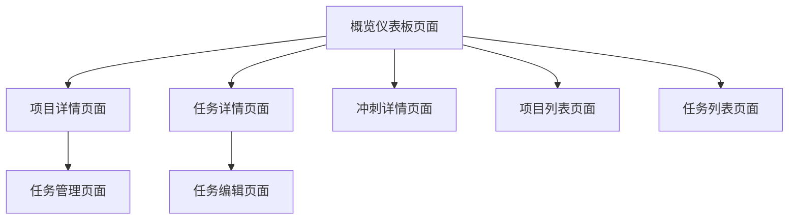

# 项目管理概览页面产品需求文档

## 1. 产品概述

项目管理概览页面是一个集中展示项目管理关键指标和数据的仪表板页面，为用户提供项目整体状况的快速洞察。
- 该页面帮助项目经理和团队成员快速了解项目进展、任务分布、团队工作量等核心信息，提升项目管理效率。
- 目标是成为项目管理的核心入口，通过数据可视化提供决策支持。

## 2. 核心功能

### 2.1 用户角色

| 角色 | 访问方式 | 核心权限 |
|------|----------|----------|
| 项目经理 | 默认用户访问 | 查看所有项目数据、团队统计、详细进度分析 |
| 团队成员 | 默认用户访问 | 查看参与项目的基本统计、个人任务概览 |
| 项目所有者 | 默认用户访问 | 查看拥有项目的完整数据、成员管理统计 |

### 2.2 功能模块

我们的项目管理概览页面包含以下主要页面：
1. **概览仪表板页面**：统计卡片区域、图表展示区域、快速操作区域、最近活动列表。

### 2.3 页面详情

| 页面名称 | 模块名称 | 功能描述 |
|----------|----------|----------|
| 概览仪表板页面 | 项目统计卡片 | 展示总项目数、活跃项目数、已完成项目数、团队成员总数等关键指标，支持点击跳转到详细页面 |
| 概览仪表板页面 | 任务状态分布图表 | 使用饼图展示待办、进行中、审核中、已完成、阻塞状态的任务分布情况 |
| 概览仪表板页面 | 项目进度图表 | 使用柱状图展示各项目的完成进度百分比，支持按时间范围筛选 |
| 概览仪表板页面 | 最近任务列表 | 展示最近更新的任务列表，包含任务标题、状态、优先级、截止日期、分配人员 |
| 概览仪表板页面 | 冲刺进度概览 | 展示当前活跃冲刺的进度情况，包含冲刺名称、进度百分比、剩余天数 |
| 概览仪表板页面 | 快速操作面板 | 提供创建新项目、创建新任务、查看所有项目等快速操作按钮 |

## 3. 核心流程

用户访问概览页面后，系统自动加载用户相关的项目管理数据。用户可以通过统计卡片快速了解整体情况，通过图表分析任务和项目分布，通过最近任务列表查看待处理事项，通过冲刺进度了解当前迭代状况。用户可以点击各个模块中的链接跳转到具体的项目、任务或冲刺详情页面。

## 4. 用户界面设计

### 4.1 设计风格

- 主色调：#3b82f6（蓝色）、#10b981（绿色）用于积极指标
- 辅助色：#f59e0b（橙色）用于警告、#ef4444（红色）用于紧急状态
- 按钮样式：圆角按钮，支持outline和filled两种风格
- 字体：系统默认字体，标题使用font-bold，正文使用font-medium
- 布局风格：卡片式布局，响应式网格系统
- 图标风格：使用Lucide图标库，简洁线性风格

### 4.2 页面设计概览

| 页面名称 | 模块名称 | UI元素 |
|----------|----------|--------|
| 概览仪表板页面 | 项目统计卡片 | 4列网格布局，每个卡片包含数字、标题、趋势图标、变化百分比，使用渐变背景和阴影效果 |
| 概览仪表板页面 | 任务状态分布图表 | 饼图组件，使用不同颜色区分状态，包含图例和数据标签，支持悬停交互 |
| 概览仪表板页面 | 项目进度图表 | 水平柱状图，显示项目名称和进度百分比，使用进度条样式，支持点击跳转 |
| 概览仪表板页面 | 最近任务列表 | 表格布局，包含任务标题、状态徽章、优先级标签、截止日期、用户头像，支持排序和筛选 |
| 概览仪表板页面 | 冲刺进度概览 | 卡片列表，每个冲刺显示名称、进度条、剩余天数、任务统计，使用紧凑布局 |
| 概览仪表板页面 | 快速操作面板 | 按钮组，使用primary和outline样式，包含图标和文字，固定在页面顶部 |

### 4.3 响应式设计

页面采用移动优先的响应式设计，在桌面端使用多列布局，在移动端自动调整为单列布局，支持触摸交互优化。统计卡片在小屏幕上堆叠显示，图表自动缩放适应屏幕宽度。