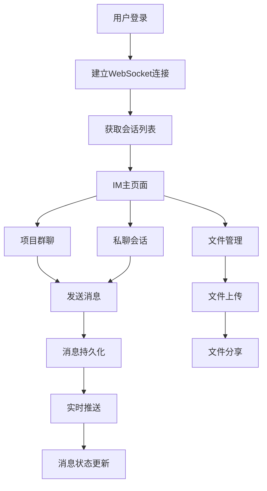

# 项目即时通讯系统 - 真实API版本

## 1. Product Overview

项目即时通讯系统是一个基于真实API的实时沟通平台，集成在项目管理系统中，支持项目群聊和个人私聊功能。

- 提供企业级的实时通讯解决方案，支持大规模并发用户
- 基于WebSocket技术实现低延迟的实时消息传输
- 与现有项目管理系统深度集成，提供上下文相关的沟通体验
- 支持消息持久化、离线消息推送、多设备同步等企业级功能

## 2. Core Features

### 2.1 User Roles

| Role       | Registration Method | Core Permissions                                   |
| ---------- | ------------------- | -------------------------------------------------- |
| 项目成员   | 通过项目邀请加入    | 可参与项目群聊，发起私聊，查看项目相关消息         |
| 项目管理员 | 项目创建者或被授权  | 具备项目成员所有权限，可管理群聊设置，查看消息统计 |
| 系统管理员 | 系统级别授权        | 可管理所有项目的IM功能，监控系统状态，配置全局设置 |

### 2.2 Feature Module

我们的即时通讯系统包含以下核心页面：

1. **IM主页面**: WebSocket连接管理、会话列表、消息展示区域、输入框
2. **会话管理页面**: 项目群聊列表、私聊会话列表、会话搜索和筛选
3. **消息设置页面**: 通知设置、消息同步设置、隐私设置
4. **文件管理页面**: 聊天文件上传、下载、预览管理

### 2.3 Page Details

| Page Name    | Module Name       | Feature description                                                  |
| ------------ | ----------------- | -------------------------------------------------------------------- |
| IM主页面     | WebSocket连接管理 | 建立和维护WebSocket连接，处理连接状态，自动重连机制                  |
| IM主页面     | 会话切换器        | 在项目群聊和私聊之间切换，显示未读消息数量，会话状态指示             |
| IM主页面     | 消息列表          | 实时显示消息，支持消息分页加载，消息状态显示（发送中、已送达、已读） |
| IM主页面     | 消息输入区        | 多行文本输入，支持@提醒，表情选择，文件拖拽上传，图片粘贴            |
| IM主页面     | 在线用户列表      | 显示项目成员在线状态，支持快速发起私聊，用户信息卡片                 |
| 会话管理页面 | 项目群聊管理      | 创建项目群聊，管理群聊成员，设置群聊权限，群聊信息编辑               |
| 会话管理页面 | 私聊会话管理      | 发起私聊，管理私聊列表，会话置顶，会话删除，消息搜索                 |
| 会话管理页面 | 会话搜索          | 按关键词搜索消息内容，按时间范围筛选，按发送者筛选                   |
| 消息设置页面 | 通知设置          | 配置消息推送规则，设置免打扰时间，声音和震动设置                     |
| 消息设置页面 | 同步设置          | 多设备消息同步，离线消息处理，消息保留时间设置                       |
| 文件管理页面 | 文件上传          | 支持多种文件格式上传，文件大小限制，上传进度显示                     |
| 文件管理页面 | 文件预览          | 图片、文档在线预览，文件下载，文件分享链接生成                       |

## 3. Core Process

### 3.1 用户操作流程

1. **登录和连接**: 用户登录系统 → 建立WebSocket连接 → 获取用户会话列表 → 同步离线消息
2. **项目群聊流程**: 选择项目 → 进入项目群聊 → 查看历史消息 → 发送消息 → 实时接收其他成员消息
3. **私聊流程**: 选择联系人 → 创建或进入私聊会话 → 发送消息 → 接收对方回复
4. **文件分享流程**: 选择文件 → 上传到服务器 → 生成分享链接 → 发送消息 → 接收方下载或预览

### 3.2 系统流程图



## 4. API Architecture

### 4.1 WebSocket API

**连接端点**: `wss://api.example.com/ws/chat`

**认证方式**: JWT Token通过查询参数传递

**消息格式**:

```json
{
  "type": "message|typing|read|join|leave",
  "data": {
    "conversationId": "string",
    "content": "string",
    "messageType": "text|image|file",
    "timestamp": "ISO8601",
    "metadata": {}
  }
}
```

### 4.2 REST API Endpoints

#### 会话管理

- `GET /api/conversations` - 获取用户会话列表
- `POST /api/conversations` - 创建新会话
- `GET /api/conversations/{id}/messages` - 获取会话消息历史
- `PUT /api/conversations/{id}/read` - 标记消息为已读

#### 消息管理

- `POST /api/messages` - 发送消息
- `GET /api/messages/{id}` - 获取消息详情
- `DELETE /api/messages/{id}` - 删除消息
- `PUT /api/messages/{id}` - 编辑消息

#### 文件管理

- `POST /api/files/upload` - 上传文件
- `GET /api/files/{id}` - 下载文件
- `GET /api/files/{id}/preview` - 文件预览

#### 用户管理

- `GET /api/users/online` - 获取在线用户列表
- `GET /api/users/{id}/status` - 获取用户状态
- `PUT /api/users/status` - 更新用户状态

### 4.3 数据模型

#### Conversation (会话)

```json
{
  "id": "string",
  "type": "project|private",
  "projectId": "string|null",
  "participants": ["userId1", "userId2"],
  "name": "string",
  "lastMessage": {
    "content": "string",
    "timestamp": "ISO8601",
    "senderId": "string"
  },
  "unreadCount": "number",
  "createdAt": "ISO8601",
  "updatedAt": "ISO8601"
}
```

#### Message (消息)

```json
{
  "id": "string",
  "conversationId": "string",
  "senderId": "string",
  "content": "string",
  "messageType": "text|image|file|system",
  "fileUrl": "string|null",
  "fileName": "string|null",
  "fileSize": "number|null",
  "replyToId": "string|null",
  "status": "sending|sent|delivered|read",
  "createdAt": "ISO8601",
  "updatedAt": "ISO8601"
}
```

## 5. User Interface Design

### 5.1 Design Style

- **主色调**: 蓝色系 (#3B82F6) 和灰色系 (#6B7280)
- **辅助色**: 绿色 (#10B981) 表示在线状态，红色 (#EF4444) 表示错误
- **按钮样式**: 圆角设计，悬停效果，渐变背景
- **字体**: 系统默认字体，消息内容14px，界面文字12px
- **布局风格**: 三栏布局（会话列表、消息区域、侧边栏），卡片式设计
- **图标风格**: 线性图标，统一的视觉语言

### 5.2 Page Design Overview

| Page Name    | Module Name         | UI Elements                                                        |
| ------------ | ------------------- | ------------------------------------------------------------------ |
| IM主页面     | WebSocket状态指示器 | 顶部状态栏，连接状态图标，绿色表示已连接，红色表示断开             |
| IM主页面     | 会话列表            | 左侧边栏，会话头像，未读消息红点，最后消息预览，时间戳             |
| IM主页面     | 消息区域            | 中央区域，消息气泡（发送者右对齐蓝色，接收者左对齐灰色），时间分组 |
| IM主页面     | 输入区域            | 底部固定，多行文本框，工具栏（表情、文件、@提醒），发送按钮        |
| IM主页面     | 在线用户            | 右侧边栏，用户头像，在线状态指示，快速操作按钮                     |
| 文件管理页面 | 上传区域            | 拖拽上传区域，进度条，文件类型图标，上传状态提示                   |

### 5.3 Responsiveness

- **桌面优先设计**: 主要针对桌面端使用场景优化
- **移动端适配**: 响应式布局，在移动端自动调整为单栏布局
- **触摸优化**: 支持触摸手势，滑动切换会话，长按显示操作菜单

## 6. Technical Implementation

### 6.1 前端技术栈

- **框架**: Next.js 14 with App Router
- **状态管理**: Zustand for WebSocket state and message cache
- **WebSocket**: 原生WebSocket API with reconnection logic
- **UI组件**: shadcn/ui components
- **文件上传**: react-dropzone with progress tracking

### 6.2 后端技术要求

- **WebSocket服务**: 支持水平扩展的WebSocket服务器
- **消息队列**: Redis for message caching and pub/sub
- **数据库**: PostgreSQL for message persistence
- **文件存储**: 云存储服务 (AWS S3/阿里云OSS)
- **认证**: JWT token validation

### 6.3 性能优化

- **消息分页**: 虚拟滚动，按需加载历史消息
- **连接管理**: 自动重连，心跳检测，连接池管理
- **缓存策略**: 本地消息缓存，离线消息同步
- **文件优化**: 图片压缩，文件分片上传，CDN加速

## 7. Security & Privacy

### 7.1 安全措施

- **消息加密**: 传输层TLS加密，敏感消息端到端加密
- **访问控制**: 基于项目权限的消息访问控制
- **审计日志**: 完整的消息操作日志记录
- **防护机制**: 防止XSS攻击，消息内容过滤

### 7.2 隐私保护

- **数据保留**: 可配置的消息保留期限
- **删除机制**: 支持消息撤回和永久删除
- **权限管理**: 细粒度的消息查看权限控制
