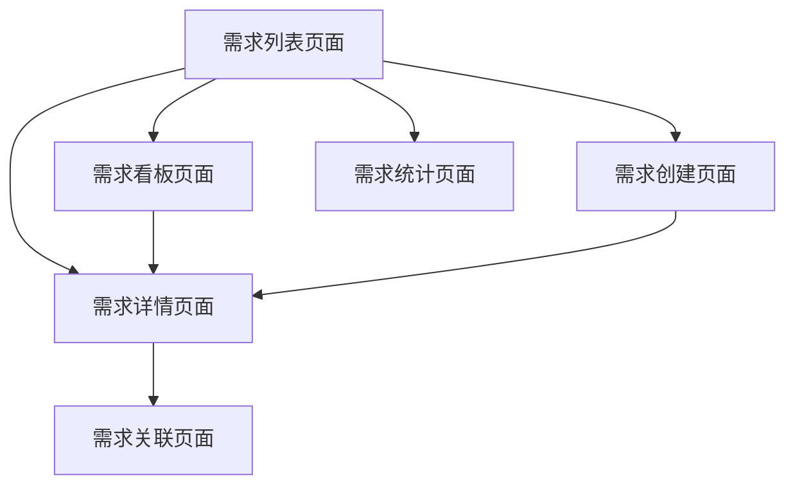

# 独立需求管理模块 - 产品需求文档

## 1. 产品概述

需求管理模块将从项目内部独立出来，成为一个独立的功能模块，用于统一管理所有项目的需求，提供跨项目的需求追溯、优先级管理和进度跟踪能力。

该模块解决了当前需求管理分散在各个项目中，难以统一管理和跨项目追溯的问题，为产品经理和项目经理提供全局的需求视图。

通过独立的需求管理模块，团队可以更好地进行需求规划、优先级排序和资源分配，提升整体项目管理效率。

## 2. 核心功能

### 2.1 用户角色

| 角色 | 注册方式 | 核心权限 |
|------|----------|----------|
| 产品经理 | 系统分配角色 | 创建、编辑、删除需求；设置需求优先级；关联项目 |
| 项目经理 | 系统分配角色 | 查看、编辑需求；关联任务；更新需求状态 |
| 开发人员 | 系统分配角色 | 查看需求详情；更新实现状态；添加技术备注 |
| 普通用户 | 默认角色 | 查看公开需求；提交需求建议 |

### 2.2 功能模块

我们的独立需求管理系统包含以下主要页面：
1. **需求列表页面**：需求筛选、搜索、批量操作功能
2. **需求看板页面**：按状态分组的可视化需求管理
3. **需求详情页面**：完整的需求信息展示和编辑
4. **需求创建页面**：新建需求的表单界面
5. **需求统计页面**：需求进度和统计数据展示
6. **需求关联页面**：管理需求与项目、任务的关联关系

### 2.3 页面详情

| 页面名称 | 模块名称 | 功能描述 |
|----------|----------|----------|
| 需求列表页面 | 需求筛选器 | 按项目、状态、优先级、负责人筛选需求；支持关键词搜索 |
| 需求列表页面 | 需求表格 | 显示需求列表，支持排序、分页；批量操作（状态更新、删除、导出） |
| 需求列表页面 | 快速操作栏 | 创建新需求、导入需求、批量分配等快捷操作 |
| 需求看板页面 | 状态列 | 按需求状态（待评估、已确认、开发中、已完成、已关闭）分组显示 |
| 需求看板页面 | 需求卡片 | 拖拽式需求状态更新；显示需求基本信息和进度 |
| 需求看板页面 | 看板设置 | 自定义状态列、筛选条件、显示字段 |
| 需求详情页面 | 需求信息 | 显示和编辑需求标题、描述、优先级、状态等基本信息 |
| 需求详情页面 | 关联管理 | 管理需求与项目、任务、其他需求的关联关系 |
| 需求详情页面 | 变更历史 | 显示需求的所有变更记录和版本历史 |
| 需求详情页面 | 评论讨论 | 需求相关的讨论和评论功能 |
| 需求创建页面 | 需求表单 | 创建新需求的完整表单，包括基本信息、详细描述、验收标准 |
| 需求创建页面 | 模板选择 | 提供常用需求模板，快速创建标准化需求 |
| 需求创建页面 | 关联设置 | 在创建时设置需求与项目的关联关系 |
| 需求统计页面 | 统计图表 | 需求数量、完成率、优先级分布等统计图表 |
| 需求统计页面 | 进度跟踪 | 各项目需求完成进度和时间线展示 |
| 需求统计页面 | 报表导出 | 生成和导出需求统计报表 |
| 需求关联页面 | 项目关联 | 管理需求与项目的关联关系，支持多项目关联 |
| 需求关联页面 | 任务关联 | 管理需求与具体任务的关联，追溯实现进度 |
| 需求关联页面 | 依赖关系 | 管理需求之间的依赖关系和优先级排序 |

## 3. 核心流程

**产品经理流程：**
产品经理登录系统后，首先进入需求列表页面查看所有需求概况。可以通过筛选器快速定位特定需求，或使用看板视图进行可视化管理。创建新需求时，填写完整的需求信息并设置优先级，然后关联到相应的项目。在需求详情页面可以持续跟踪需求的实现进度和讨论。

**项目经理流程：**
项目经理主要通过需求列表和看板视图管理项目相关需求。可以更新需求状态、关联具体任务，并在需求详情页面与团队成员进行讨论。通过统计页面了解项目需求的整体进度。

**开发人员流程：**
开发人员主要查看分配给自己的需求，在需求详情页面了解具体要求和验收标准。可以更新实现状态、添加技术备注，并参与需求相关的讨论。

## 4. 用户界面设计

### 4.1 设计风格

- **主色调**：#3B82F6（蓝色）作为主色，#10B981（绿色）作为成功状态色
- **辅助色**：#6B7280（灰色）用于次要信息，#EF4444（红色）用于警告和错误
- **按钮样式**：圆角按钮设计，主要按钮使用渐变效果
- **字体**：Inter 字体，标题使用 16-24px，正文使用 14px，辅助信息使用 12px
- **布局风格**：卡片式布局，顶部导航栏设计
- **图标风格**：使用 Lucide 图标库，线性风格图标

### 4.2 页面设计概览

| 页面名称 | 模块名称 | UI元素 |
|----------|----------|--------|
| 需求列表页面 | 需求筛选器 | 下拉选择器、搜索框、标签筛选；使用卡片容器，白色背景，阴影效果 |
| 需求列表页面 | 需求表格 | 数据表格组件，斑马纹行样式，悬停高亮；操作按钮使用图标+文字形式 |
| 需求看板页面 | 状态列 | 垂直列布局，每列使用不同的背景色标识状态；拖拽区域有虚线边框提示 |
| 需求看板页面 | 需求卡片 | 圆角卡片设计，左侧彩色边框表示优先级；卡片内使用标签显示状态和类型 |
| 需求详情页面 | 需求信息 | 表单布局，输入框使用边框样式；重要信息使用高亮背景 |
| 需求详情页面 | 关联管理 | 标签式展示关联项目和任务；使用连接线图表显示依赖关系 |
| 需求创建页面 | 需求表单 | 分步骤表单设计，进度指示器；必填字段使用红色星号标识 |
| 需求统计页面 | 统计图表 | 使用 Chart.js 图表库，饼图和柱状图展示；配色与主题保持一致 |

### 4.3 响应式设计

系统采用桌面优先的响应式设计，在移动端进行适配优化。需求看板在移动端转换为垂直滚动的卡片列表，表格在小屏幕上使用卡片式布局展示。支持触摸操作优化，包括拖拽手势和长按菜单。