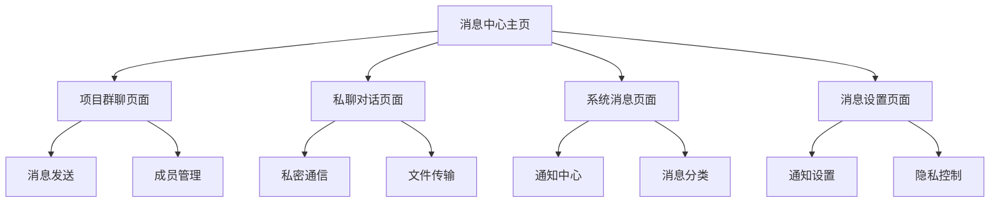

# 消息中心模块产品需求文档

## 1. 产品概述

消息中心是一个统一的通信平台，整合了项目成员私聊、项目群聊和系统消息功能，为用户提供完整的项目协作通信体验。

该模块解决了项目协作中信息分散、沟通效率低下的问题，让项目成员能够在一个统一的界面中处理所有类型的消息通信，提升团队协作效率。

产品目标是打造企业级项目管理系统中最核心的通信枢纽，支撑高效的团队协作和信息流转。

## 2. 核心功能

### 2.1 用户角色

| 角色    | 注册方式     | 核心权限                          |
| ----- | -------- | ----------------------------- |
| 项目成员  | 项目邀请加入   | 可参与项目群聊、发起私聊、接收系统消息、接收实时推送通知  |
| 项目管理员 | 项目所有者指定  | 拥有成员权限，可管理群聊设置、查看消息统计、配置通知规则  |
| 项目所有者 | 创建项目自动获得 | 拥有所有消息功能权限，可管理所有通信设置、配置全局通知策略 |
| 系统管理员 | 系统级别权限   | 可发送系统消息、管理全局消息设置、配置全局通知策略     |

### 2.2 功能模块

我们的消息中心包含以下主要页面：

1. **消息中心主页**：统一消息入口、会话列表、消息概览、实时状态显示
2. **项目群聊页面**：项目团队群组聊天、文件分享、消息历史、群组实时通知
3. **私聊对话页面**：一对一私密沟通、消息加密、阅读状态、实时消息推送
4. **系统消息页面**：系统通知、公告消息、重要提醒、重要消息置顶
5. **项目通知页面**：专门处理项目管理相关的通知消息
6. **消息设置页面**：通知偏好、隐私设置、消息管理、全局提醒配置
7. **全局通知组件**：浏览器通知、音效提示、页面内弹窗、状态栏提醒

#### 2.2.1 项目管理通知系统

**核心通知类型：**

* **项目进度通知**：项目状态变更、里程碑达成、进度延期警告、项目完成通知

* **任务管理通知**：任务创建、分配、状态变更、完成确认、延期提醒、优先级调整

* **成员管理通知**：成员加入项目、离开项目、角色权限变更、成员状态更新

* **文档变更通知**：需求文档更新、设计文档修改、技术文档发布

* **截止日期提醒**：项目截止日期临近、任务到期提醒、里程碑时间节点

* **审批流程通知**：需求审批、任务审核、项目变更申请的状态更新

**通知优先级分级：**

* **紧急**：项目严重延期、关键任务失败、重要成员离职

* **重要**：里程碑达成、任务完成、新成员加入

* **普通**：一般状态更新、文档修改、常规提醒

* **低优先级**：统计报告、定期汇总、非关键信息更新

### 2.3 页面详情

| 页面名称   | 模块名称   | 功能描述                                      |
| ------ | ------ | ----------------------------------------- |
| 消息中心主页 | 会话列表   | 显示所有类型会话，包括群聊、私聊、系统消息、项目通知，支持搜索和筛选，实时更新   |
| 消息中心主页 | 消息概览   | 展示未读消息数量、最新消息预览、重要消息提醒、项目通知摘要             |
| 消息中心主页 | 快速操作   | 提供新建私聊、切换项目群聊、消息设置、项目通知订阅等快捷入口            |
| 消息中心主页 | 实时状态显示 | 显示在线状态、连接状态、消息同步状态、项目通知状态等实时信息            |
| 项目群聊页面 | 消息发送   | 支持文本、图片、文件发送，@成员提醒，消息回复和引用，实时同步所有成员消息     |
| 项目群聊页面 | 成员管理   | 显示实时在线成员状态、成员权限管理、邀请新成员                   |
| 项目群聊页面 | 消息历史   | 消息搜索、历史记录浏览、重要消息标记和收藏                     |
| 项目群聊页面 | 群组实时通知 | 新成员加入、成员退出、重要消息等群组事件的实时推送                 |
| 私聊对话页面 | 私密通信   | 端到端加密聊天、消息撤回、阅读回执、消息转发，实时显示消息状态           |
| 私聊对话页面 | 文件传输   | 安全文件传输、文件预览、传输进度显示                        |
| 私聊对话页面 | 会话管理   | 会话置顶、消息免打扰、聊天记录导出                         |
| 私聊对话页面 | 实时消息推送 | 通过WebSocket接收新消息，立即显示并触发通知提醒              |
| 系统消息页面 | 通知中心   | 系统公告、项目通知、任务提醒、权限变更通知，实时接收新通知             |
| 系统消息页面 | 消息分类   | 按类型分类显示：公告、提醒、警告、系统更新等                    |
| 系统消息页面 | 批量操作   | 批量标记已读、批量删除、消息归档                          |
| 系统消息页面 | 重要消息置顶 | 紧急或重要的系统消息自动置顶显示，确保及时处理                   |
| 项目通知页面 | 项目通知列表 | 显示项目相关的所有通知（进度变动、任务状态、成员变动等），支持按项目和通知类型筛选 |
| 项目通知页面 | 通知详情   | 查看项目通知的详细信息，提供快速跳转到相关项目或任务的链接             |
| 项目通知页面 | 通知订阅管理 | 管理用户对不同项目和通知类型的订阅设置                       |
| 项目通知页面 | 通知统计   | 显示项目通知的统计信息，包括通知频率、响应时间等数据                |
| 消息设置页面 | 通知设置   | 推送通知开关、声音提醒、桌面通知、邮件通知设置，包括项目管理通知的个性化设置    |
| 消息设置页面 | 隐私控制   | 在线状态显示、消息预览设置、陌生人消息拦截                     |
| 消息设置页面 | 存储管理   | 消息自动清理、聊天记录备份、存储空间管理                      |
| 消息设置页面 | 全局提醒配置 | 配置浏览器通知权限、音效选择、提醒频率等全局通知设置                |
| 消息设置页面 | 项目通知订阅 | 精细化管理项目通知订阅，支持按项目、通知类型、优先级等维度设置           |
| 全局通知组件 | 浏览器通知  | 利用浏览器Notification API发送桌面通知，显示消息摘要和项目通知   |
| 全局通知组件 | 音效提示   | 播放不同类型消息的提示音效，支持自定义音效，包括项目通知专用音效          |
| 全局通知组件 | 页面内弹窗  | 在页面内显示消息提醒弹窗，支持快速回复和操作，包括项目通知的快速处理        |
| 全局通知组件 | 状态栏提醒  | 在页面顶部或底部显示消息提醒条，显示未读消息数量和项目通知计数           |

## 3. 核心流程

### 项目成员使用流程

1. 用户登录系统后，点击导航栏的"消息中心"进入主页
2. 在会话列表中查看所有类型的对话，包括项目群聊、私聊和系统消息
3. 点击项目群聊进入团队沟通界面，可以发送消息、@成员、分享文件
4. 点击私聊会话进行一对一沟通，享受加密的私密对话
5. 查看系统消息获取重要通知和公告信息
6. 通过设置页面个性化配置通知和隐私选项

### 管理员操作流程

1. 管理员除了拥有普通成员的所有功能外，还可以管理群聊设置
2. 在项目群聊中可以管理成员权限、设置群聊公告、管理消息权限
3. 可以查看消息统计数据，了解团队沟通活跃度
4. 系统管理员可以发送全局系统消息和重要公告



## 4. 用户界面设计

### 4.1 设计风格

* **主色调**：蓝紫渐变色系（#667eea 到 #764ba2），体现现代科技感

* **辅助色**：清新绿色（#10b981）表示在线状态，温暖橙色（#f59e0b）表示提醒，深蓝色（#1e40af）表示项目通知

* **状态色彩**：成功绿色 #10B981、警告橙色 #F59E0B、错误红色 #EF4444、信息蓝色 #3B82F6、项目通知紫色 #8B5CF6

* **按钮样式**：圆角设计，支持悬停渐变效果和微动画反馈

* **字体**：主要使用系统默认字体，标题16px，正文14px，辅助信息12px

* **布局风格**：卡片式设计，左侧会话列表+右侧消息详情的经典IM布局

* **图标风格**：线性图标配合实心图标，支持状态变化动画

* **通知标识**：使用红点、数字徽章、颜色编码等视觉元素区分不同优先级的通知，项目通知使用特殊的紫色标识

### 4.2 页面设计概览

| 页面名称   | 模块名称 | UI元素                                                    |
| ------ | ---- | ------------------------------------------------------- |
| 消息中心主页 | 会话列表 | 左侧固定宽度300px，白色背景，每个会话项高度60px，包含头像、名称、最新消息预览、时间和未读数量红色圆点 |
| 消息中心主页 | 消息概览 | 右侧主要区域，渐变背景，居中显示欢迎信息和快速操作按钮，采用卡片式布局                     |
| 项目群聊页面 | 消息区域 | 右侧主要区域，白色背景，消息气泡左右对齐，发送者消息右对齐蓝色渐变，接收消息左对齐灰色背景           |
| 项目群聊页面 | 输入框  | 底部固定，白色背景带阴影，支持多行输入，右侧发送按钮蓝色渐变，左侧附件和表情按钮                |
| 私聊对话页面 | 对话界面 | 与群聊类似布局，但消息气泡采用更私密的深色主题，支持加密状态指示器                       |
| 系统消息页面 | 消息列表 | 卡片式布局，每条消息独立卡片，根据消息类型显示不同颜色边框：蓝色（通知）、橙色（提醒）、红色（警告）      |
| 消息设置页面 | 设置面板 | 分组式设置界面，每个设置组采用白色卡片，开关按钮使用品牌色，清晰的视觉层次                   |

### 4.3 响应式设计

产品采用桌面优先的设计策略，同时完美适配移动端。在移动设备上，会话列表和消息详情采用全屏切换模式，支持手势操作和触摸优化，确保在各种设备上都能提供优秀的用户体验。

## 5. 技术实现方案

### 5.1 技术架构

* **前端框架**：Next.js + React + TypeScript

* **UI组件库**：shadcn/ui + Tailwind CSS

* **状态管理**：Zustand

* **实时通信**：WebSocket + Socket.io（禁止轮询）

* **推送通知**：浏览器Notification API + Service Worker

* **音效系统**：Web Audio API

* **数据库**：PostgreSQL + Prisma ORM

* **文件存储**：本地存储 + 云存储（可选）

* **身份认证**：NextAuth.js

* **权限控制**：基于角色的访问控制（RBAC）

* **项目管理通知系统**：事件驱动架构 + 消息队列 + 通知引擎

### 5.2 实时推送技术方案

#### 5.2.1 WebSocket连接管理

* **连接建立**：用户登录后自动建立WebSocket连接

* **连接保持**：心跳机制维持连接活跃状态

* **断线重连**：自动重连机制，确保消息不丢失

* **多标签页同步**：使用BroadcastChannel API同步多标签页状态

#### 5.2.2 消息推送机制

* **即时推送**：新消息通过WebSocket立即推送到客户端

* **离线消息**：用户重新上线时推送离线期间的消息

* **消息确认**：客户端接收消息后发送确认回执

* **消息去重**：防止重复消息的机制

#### 5.2.3 全局通知系统

* **通知权限管理**：请求和管理浏览器通知权限

* **通知分级**：根据消息重要性设置不同的通知样式

* **通知聚合**：多条消息智能聚合显示

* **通知交互**：支持通知点击跳转和快速操作

### 5.3 数据库设计

#### 核心数据表

**消息表 (messages)**

```sql
CREATE TABLE messages (
  id VARCHAR(36) PRIMARY KEY,
  content TEXT NOT NULL,
  message_type ENUM('text', 'image', 'file', 'system', 'project_notification') DEFAULT 'text',
  sender_id VARCHAR(36) NOT NULL,
  receiver_id VARCHAR(36),
  conversation_id VARCHAR(36) NOT NULL,
  is_read BOOLEAN DEFAULT FALSE,
  priority ENUM('low', 'normal', 'important', 'urgent') DEFAULT 'normal',
  created_at TIMESTAMP DEFAULT CURRENT_TIMESTAMP,
  updated_at TIMESTAMP DEFAULT CURRENT_TIMESTAMP ON UPDATE CURRENT_TIMESTAMP,
  FOREIGN KEY (sender_id) REFERENCES users(id),
  FOREIGN KEY (receiver_id) REFERENCES users(id),
  FOREIGN KEY (conversation_id) REFERENCES conversations(id)
);
```

**会话表 (conversations)**

```sql
CREATE TABLE conversations (
  id VARCHAR(36) PRIMARY KEY,
  conversation_type ENUM('private', 'group', 'system', 'project_notification') NOT NULL,
  project_id VARCHAR(36),
  title VARCHAR(255),
  created_at TIMESTAMP DEFAULT CURRENT_TIMESTAMP,
  updated_at TIMESTAMP DEFAULT CURRENT_TIMESTAMP ON UPDATE CURRENT_TIMESTAMP,
  FOREIGN KEY (project_id) REFERENCES projects(id)
);
```

**会话参与者表 (conversation\_participants)**

```sql
CREATE TABLE conversation_participants (
  id VARCHAR(36) PRIMARY KEY,
  conversation_id VARCHAR(36) NOT NULL,
  user_id VARCHAR(36) NOT NULL,
  joined_at TIMESTAMP DEFAULT CURRENT_TIMESTAMP,
  last_read_at TIMESTAMP,
  FOREIGN KEY (conversation_id) REFERENCES conversations(id),
  FOREIGN KEY (user_id) REFERENCES users(id),
  UNIQUE KEY unique_participant (conversation_id, user_id)
);
```

**项目通知表 (project\_notifications)**

```sql
CREATE TABLE project_notifications (
  id VARCHAR(36) PRIMARY KEY,
  project_id VARCHAR(36) NOT NULL,
  notification_type ENUM('project_progress', 'task_status', 'member_change', 'document_update', 'deadline_reminder', 'approval_process') NOT NULL,
  title VARCHAR(255) NOT NULL,
  content TEXT NOT NULL,
  priority ENUM('low', 'normal', 'important', 'urgent') DEFAULT 'normal',
  trigger_event VARCHAR(100) NOT NULL,
  related_entity_type ENUM('project', 'task', 'user', 'document') NOT NULL,
  related_entity_id VARCHAR(36) NOT NULL,
  created_by VARCHAR(36) NOT NULL,
  created_at TIMESTAMP DEFAULT CURRENT_TIMESTAMP,
  FOREIGN KEY (project_id) REFERENCES projects(id),
  FOREIGN KEY (created_by) REFERENCES users(id)
);
```

**项目通知订阅表 (project\_notification\_subscriptions)**

```sql
CREATE TABLE project_notification_subscriptions (
  id VARCHAR(36) PRIMARY KEY,
  user_id VARCHAR(36) NOT NULL,
  project_id VARCHAR(36) NOT NULL,
  notification_type ENUM('project_progress', 'task_status', 'member_change', 'document_update', 'deadline_reminder', 'approval_process') NOT NULL,
  is_subscribed BOOLEAN DEFAULT TRUE,
  priority_filter ENUM('all', 'important_urgent', 'urgent_only') DEFAULT 'all',
  created_at TIMESTAMP DEFAULT CURRENT_TIMESTAMP,
  updated_at TIMESTAMP DEFAULT CURRENT_TIMESTAMP ON UPDATE CURRENT_TIMESTAMP,
  FOREIGN KEY (user_id) REFERENCES users(id),
  FOREIGN KEY (project_id) REFERENCES projects(id),
  UNIQUE KEY unique_subscription (user_id, project_id, notification_type)
);
```

**用户通知设置表 (user\_notification\_settings)**

```sql
CREATE TABLE user_notification_settings (
  id VARCHAR(36) PRIMARY KEY,
  user_id VARCHAR(36) NOT NULL,
  notification_type ENUM('browser', 'sound', 'email', 'popup') NOT NULL,
  message_type ENUM('private', 'group', 'system', 'project_notification', 'all') NOT NULL,
  is_enabled BOOLEAN DEFAULT TRUE,
  quiet_hours_start TIME,
  quiet_hours_end TIME,
  created_at TIMESTAMP DEFAULT CURRENT_TIMESTAMP,
  updated_at TIMESTAMP DEFAULT CURRENT_TIMESTAMP ON UPDATE CURRENT_TIMESTAMP,
  FOREIGN KEY (user_id) REFERENCES users(id),
  UNIQUE KEY unique_setting (user_id, notification_type, message_type)
);
```

**消息通知记录表 (message\_notifications)**

```sql
CREATE TABLE message_notifications (
  id VARCHAR(36) PRIMARY KEY,
  message_id VARCHAR(36),
  project_notification_id VARCHAR(36),
  user_id VARCHAR(36) NOT NULL,
  notification_type ENUM('browser', 'sound', 'email', 'popup') NOT NULL,
  sent_at TIMESTAMP DEFAULT CURRENT_TIMESTAMP,
  is_delivered BOOLEAN DEFAULT FALSE,
  delivered_at TIMESTAMP,
  FOREIGN KEY (message_id) REFERENCES messages(id),
  FOREIGN KEY (project_notification_id) REFERENCES project_notifications(id),
  FOREIGN KEY (user_id) REFERENCES users(id)
);
```

**通知模板表 (notification\_templates)**

```sql
CREATE TABLE notification_templates (
  id VARCHAR(36) PRIMARY KEY,
  template_type ENUM('project_progress', 'task_status', 'member_change', 'document_update', 'deadline_reminder', 'approval_process') NOT NULL,
  event_trigger VARCHAR(100) NOT NULL,
  title_template VARCHAR(255) NOT NULL,
  content_template TEXT NOT NULL,
  priority ENUM('low', 'normal', 'important', 'urgent') DEFAULT 'normal',
  is_active BOOLEAN DEFAULT TRUE,
  created_at TIMESTAMP DEFAULT CURRENT_TIMESTAMP,
  updated_at TIMESTAMP DEFAULT CURRENT_TIMESTAMP ON UPDATE CURRENT_TIMESTAMP,
  UNIQUE KEY unique_template (template_type, event_trigger)
);
```

### 5.4 API设计

#### WebSocket事件

```typescript
// 客户端发送事件
interface ClientEvents {
  'message:send': (data: SendMessageData) => void;
  'message:read': (messageId: string) => void;
  'conversation:join': (conversationId: string) => void;
  'conversation:leave': (conversationId: string) => void;
  'user:online': () => void;
  'user:offline': () => void;
  'project:subscribe': (projectId: string) => void;
  'project:unsubscribe': (projectId: string) => void;
  'notification:permission': (permission: NotificationPermission) => void;
}

// 服务器发送事件
interface ServerEvents {
  'message:new': (message: Message) => void;
  'message:updated': (message: Message) => void;
  'message:notification': (notification: MessageNotification) => void;
  'user:status': (data: UserStatusData) => void;
  'notification:new': (notification: Notification) => void;
  'project:notification': (notification: ProjectNotification) => void;
  'project:update': (data: ProjectUpdateData) => void;
  'system:broadcast': (message: SystemMessage) => void;
}
```

#### REST API端点

```typescript
// 消息相关
GET /api/messages - 获取消息列表
POST /api/messages - 发送消息
PUT /api/messages/:id/read - 标记消息已读
GET /api/conversations - 获取会话列表
POST /api/conversations - 创建会话
GET /api/conversations/:id/messages - 获取会话消息
POST /api/upload - 文件上传

// 项目通知相关
GET /api/project-notifications - 获取项目通知列表
GET /api/project-notifications/:id - 获取通知详情
POST /api/project-notifications - 创建项目通知
PUT /api/project-notifications/:id/read - 标记通知已读
DELETE /api/project-notifications/:id - 删除通知

// 项目通知订阅
GET /api/project-notifications/subscriptions - 获取用户订阅设置
PUT /api/project-notifications/subscriptions - 更新订阅设置
POST /api/project-notifications/subscriptions/batch - 批量更新订阅

// 通知设置
GET /api/notifications/settings - 获取通知设置
PUT /api/notifications/settings - 更新通知设置
POST /api/notifications/permission - 请求通知权限
GET /api/notifications/history - 获取通知历史

// 通知模板管理
GET /api/notification-templates - 获取通知模板列表
POST /api/notification-templates - 创建通知模板
PUT /api/notification-templates/:id - 更新通知模板
DELETE /api/notification-templates/:id - 删除通知模板
```

### 5.5 全局通知系统实现

#### 5.5.1 浏览器通知

```typescript
// 通知权限请求
const requestNotificationPermission = async () => {
  if ('Notification' in window) {
    const permission = await Notification.requestPermission();
    return permission === 'granted';
  }
  return false;
};

// 发送桌面通知
const sendBrowserNotification = (message: Message) => {
  if (Notification.permission === 'granted') {
    new Notification(message.sender.name, {
      body: message.content,
      icon: '/icons/message-icon.png',
      tag: message.id,
      requireInteraction: message.priority === 'urgent'
    });
  }
};
```

**通知服务核心代码：**

```typescript
// lib/notification-service.ts
export class NotificationService {
  private static instance: NotificationService;
  private permission: NotificationPermission = 'default';
  private audioContext: AudioContext | null = null;
  
  static getInstance(): NotificationService {
    if (!NotificationService.instance) {
      NotificationService.instance = new NotificationService();
    }
    return NotificationService.instance;
  }
  
  async requestPermission(): Promise<NotificationPermission> {
    if ('Notification' in window) {
      this.permission = await Notification.requestPermission();
    }
    return this.permission;
  }
  
  async showNotification(title: string, options: NotificationOptions & { priority?: 'low' | 'normal' | 'important' | 'urgent' } = {}) {
    if (this.permission === 'granted') {
      const { priority = 'normal', ...notificationOptions } = options;
      
      const notification = new Notification(title, {
        icon: this.getIconByPriority(priority),
        badge: '/favicon.ico',
        requireInteraction: priority === 'urgent',
        ...notificationOptions
      });
      
      notification.onclick = () => {
        window.focus();
        notification.close();
        // 处理点击事件，跳转到相关页面
        if (options.data?.url) {
          window.location.href = options.data.url;
        }
      };
      
      // 根据优先级设置自动关闭时间
      const autoCloseTime = this.getAutoCloseTime(priority);
      if (autoCloseTime > 0) {
        setTimeout(() => notification.close(), autoCloseTime);
      }
    }
  }
  
  private getIconByPriority(priority: string): string {
    const iconMap = {
      low: '/icons/notification-low.png',
      normal: '/icons/notification-normal.png',
      important: '/icons/notification-important.png',
      urgent: '/icons/notification-urgent.png'
    };
    return iconMap[priority] || iconMap.normal;
  }
  
  private getAutoCloseTime(priority: string): number {
    const timeMap = {
      low: 3000,
      normal: 5000,
      important: 8000,
      urgent: 0 // 不自动关闭
    };
    return timeMap[priority] || 5000;
  }
  
  playNotificationSound(soundType: 'message' | 'system' | 'project' | 'urgent' = 'message') {
    const soundMap = {
      message: '/sounds/message.mp3',
      system: '/sounds/system.mp3',
      project: '/sounds/project.mp3',
      urgent: '/sounds/urgent.mp3'
    };
    
    const audio = new Audio(soundMap[soundType]);
    audio.volume = 0.5;
    audio.play().catch(console.error);
  }
  
  showToast(message: string, type: 'info' | 'success' | 'warning' | 'error' | 'project' = 'info') {
    // 使用 toast 组件显示页面内通知
    // 这里需要与具体的 toast 实现集成
  }
}
```

#### 5.5.2 音效提示系统

```typescript
// 音效管理
class NotificationSounds {
  private audioContext: AudioContext;
  private sounds: Map<string, AudioBuffer>;
  
  async playNotificationSound(type: 'message' | 'mention' | 'system') {
    const soundBuffer = this.sounds.get(type);
    if (soundBuffer && this.audioContext) {
      const source = this.audioContext.createBufferSource();
      source.buffer = soundBuffer;
      source.connect(this.audioContext.destination);
      source.start();
    }
  }
}
```

#### 5.5.3 页面内通知组件

* **Toast通知**：轻量级消息提示，自动消失

* **Modal弹窗**：重要消息的模态提醒

* **状态栏提醒**：持续显示的消息计数

* **徽章提示**：导航菜单上的红点提醒

### 5.6 项目管理通知触发机制

**事件监听器实现：**

```typescript
// lib/project-notification-engine.ts
export class ProjectNotificationEngine {
  private static instance: ProjectNotificationEngine;
  private eventListeners: Map<string, Function[]> = new Map();
  
  static getInstance(): ProjectNotificationEngine {
    if (!ProjectNotificationEngine.instance) {
      ProjectNotificationEngine.instance = new ProjectNotificationEngine();
    }
    return ProjectNotificationEngine.instance;
  }
  
  // 注册事件监听器
  registerEventListener(eventType: string, callback: Function) {
    if (!this.eventListeners.has(eventType)) {
      this.eventListeners.set(eventType, []);
    }
    this.eventListeners.get(eventType)?.push(callback);
  }
  
  // 触发项目通知
  async triggerNotification(event: ProjectEvent) {
    const template = await this.getNotificationTemplate(event.type, event.trigger);
    if (!template) return;
    
    const notification = await this.createProjectNotification(event, template);
    const subscribers = await this.getSubscribers(event.projectId, event.type);
    
    for (const subscriber of subscribers) {
      await this.sendNotificationToUser(notification, subscriber);
    }
  }
  
  private async createProjectNotification(event: ProjectEvent, template: NotificationTemplate) {
    const notification = {
      id: generateId(),
      projectId: event.projectId,
      notificationType: event.type,
      title: this.renderTemplate(template.titleTemplate, event.data),
      content: this.renderTemplate(template.contentTemplate, event.data),
      priority: template.priority,
      triggerEvent: event.trigger,
      relatedEntityType: event.entityType,
      relatedEntityId: event.entityId,
      createdBy: event.userId,
      createdAt: new Date()
    };
    
    // 保存到数据库
    await prisma.projectNotification.create({ data: notification });
    return notification;
  }
  
  private renderTemplate(template: string, data: any): string {
    return template.replace(/\{\{(\w+)\}\}/g, (match, key) => {
      return data[key] || match;
    });
  }
  
  private async getSubscribers(projectId: string, notificationType: string) {
    return await prisma.projectNotificationSubscription.findMany({
      where: {
        projectId,
        notificationType,
        isSubscribed: true
      },
      include: {
        user: true
      }
    });
  }
  
  private async sendNotificationToUser(notification: any, subscriber: any) {
    const notificationService = NotificationService.getInstance();
    
    // 检查用户通知设置
    const userSettings = await this.getUserNotificationSettings(subscriber.userId);
    
    // 发送浏览器通知
    if (userSettings.browserEnabled) {
      await notificationService.showNotification(notification.title, {
        body: notification.content,
        priority: notification.priority,
        data: {
          url: `/projects/${notification.projectId}`,
          notificationId: notification.id
        }
      });
    }
    
    // 播放音效
    if (userSettings.soundEnabled) {
      notificationService.playNotificationSound('project');
    }
    
    // 发送WebSocket消息
    this.sendWebSocketNotification(subscriber.userId, notification);
  }
}
```

**项目事件触发示例：**

```typescript
// 在项目状态更新时触发通知
export async function updateProjectStatus(projectId: string, newStatus: string, userId: string) {
  // 更新项目状态
  await prisma.project.update({
    where: { id: projectId },
    data: { status: newStatus }
  });
  
  // 触发通知
  const notificationEngine = ProjectNotificationEngine.getInstance();
  await notificationEngine.triggerNotification({
    type: 'project_progress',
    trigger: 'status_changed',
    projectId,
    entityType: 'project',
    entityId: projectId,
    userId,
    data: {
      projectName: project.name,
      oldStatus: project.status,
      newStatus,
      userName: user.name
    }
  });
}

// 在任务状态更新时触发通知
export async function updateTaskStatus(taskId: string, newStatus: string, userId: string) {
  const task = await prisma.task.update({
    where: { id: taskId },
    data: { status: newStatus },
    include: { project: true, assignee: true }
  });
  
  const notificationEngine = ProjectNotificationEngine.getInstance();
  await notificationEngine.triggerNotification({
    type: 'task_status',
    trigger: 'task_status_changed',
    projectId: task.projectId,
    entityType: 'task',
    entityId: taskId,
    userId,
    data: {
      taskTitle: task.title,
      projectName: task.project.name,
      assigneeName: task.assignee?.name,
      oldStatus: task.status,
      newStatus,
      userName: user.name
    }
  });
}
```

### 5.7 技术约束和要求

#### 5.7.1 实时通信约束

* **严禁轮询**：不允许使用任何形式的轮询获取消息

* **WebSocket优先**：必须使用WebSocket作为主要通信方式

* **降级方案**：WebSocket不可用时使用Server-Sent Events

* **连接管理**：实现智能重连和连接状态监控

#### 5.7.2 通知系统要求

* **权限管理**：优雅处理通知权限被拒绝的情况

* **用户体验**：通知不能过于频繁，避免打扰用户

* **性能优化**：通知系统不能影响主应用性能

* **跨平台兼容**：确保在不同浏览器和设备上正常工作

#### 5.7.3 安全性要求

* **消息加密**：敏感消息内容需要加密传输

* **权限验证**：严格验证用户的消息发送和接收权限

* **防护机制**：防止消息轰炸和恶意通知

* **数据保护**：遵循数据保护法规，保护用户隐私

## 6. 开发优先级

### 6.1 第一阶段（核心功能）

1. **基础消息系统**：私聊、群聊基本功能
2. **WebSocket连接**：实时通信基础设施
3. **消息存储**：数据库设计和基本CRUD操作
4. **用户界面**：消息列表、聊天界面基本布局

### 6.2 第二阶段（通知系统）

1. **全局通知服务**：浏览器通知、音效提示
2. **系统消息**：系统通知的发送和接收
3. **通知设置**：用户个性化通知配置
4. **消息状态**：已读、未读状态管理

### 6.3 第三阶段（项目管理通知）

1. **项目通知引擎**：事件监听和通知触发机制
2. **通知模板系统**：可配置的通知模板管理
3. **订阅管理**：用户项目通知订阅设置
4. **项目通知界面**：专门的项目通知页面和管理功能

### 6.4 第四阶段（高级功能）

1. **文件上传**：图片、文件分享功能
2. **消息搜索**：历史消息搜索和筛选
3. **群组管理**：群组设置、成员管理
4. **性能优化**：消息分页、缓存策略
5. **通知统计**：通知发送统计和分析功能

## 7. 测试策略

### 7.1 功能测试

#### 7.1.1 基础消息功能

* **消息发送接收**：测试各种类型消息的正常发送和接收

* **实时性验证**：确保消息能够实时推送到所有相关用户

* **通知功能**：测试浏览器通知、音效、弹窗等各种提醒方式

* **权限控制**：验证用户权限和消息访问控制

* **WebSocket连接稳定性测试**：测试连接建立、断线重连、心跳机制

* **多用户并发测试**：测试多用户同时发送消息的场景

#### 7.1.2 项目管理通知功能

* **通知触发测试**：验证各种项目事件能正确触发通知

  * 项目状态变更通知

  * 任务创建、分配、完成通知

  * 成员加入、离开项目通知

  * 文档更新通知

  * 截止日期提醒

  * 审批流程通知

* **订阅管理测试**：测试用户订阅设置的正确性

* **通知模板测试**：验证通知模板的渲染和变量替换

* **优先级处理测试**：测试不同优先级通知的处理逻辑

* **批量通知测试**：测试大量用户同时接收通知的性能

* **通知去重测试**：验证重复通知的过滤机制

### 7.2 性能测试

#### 7.2.1 基础性能

* **并发连接**：测试大量用户同时在线的性能表现

* **消息吞吐量**：测试高频消息发送的处理能力

* **内存使用**：监控长时间运行的内存占用情况

* **网络优化**：测试不同网络条件下的表现

* **大量消息处理性能**：测试消息列表加载和渲染性能

* **移动端性能测试**：测试移动设备上的性能表现

#### 7.2.2 项目通知性能

* **通知引擎性能**：测试大量项目事件同时触发时的处理能力

* **订阅查询性能**：测试大量用户订阅关系的查询效率

* **模板渲染性能**：测试通知模板批量渲染的性能

* **数据库性能**：测试项目通知相关表的查询和写入性能

* **通知分发性能**：测试向大量用户分发通知的效率

### 7.3 兼容性测试

* **浏览器兼容**：测试主流浏览器的兼容性

* **设备适配**：测试桌面和移动设备的适配效果

* **通知权限**：测试不同浏览器的通知权限处理

* **WebSocket兼容性**：测试不同环境下的WebSocket连接稳定性

* **网络环境适应性测试**：测试弱网络环境下的表现

* **降级方案验证**：测试WebSocket不可用时的降级处理

### 7.4 安全测试

* **消息加密**：验证敏感消息的加密传输

* **权限验证**：测试用户身份验证和授权机制

* **XSS防护**：测试跨站脚本攻击防护

* **CSRF防护**：测试跨站请求伪造防护

* **项目通知权限**：验证用户只能接收有权限的项目通知

* **数据隐私保护**：测试用户数据的隐私保护机制

### 7.5 用户体验测试

* **通知频率控制**：测试通知不会过于频繁打扰用户

* **免打扰模式**：测试免打扰时间段的正确执行

* **通知分组**：测试相似通知的合并和分组显示

* **响应式设计**：测试不同屏幕尺寸下的用户体验

* **加载性能**：测试页面加载速度和响应时间

* **交互反馈**：测试用户操作的即时反馈

### 7.6 集成测试

* **项目管理系统集成**：测试与现有项目管理功能的集成

* **用户权限系统集成**：测试与RBAC权限系统的集成

* **数据库事务**：测试复杂业务场景下的数据一致性

* **第三方服务集成**：测试邮件通知等第三方服务的集成

* **API接口测试**：测试REST API和WebSocket接口的正确性

### 7.7 压力测试

* **高并发场景**：测试系统在高并发情况下的稳定性

* **大数据量处理**：测试处理大量历史消息的能力

* **长时间运行**：测试系统长时间运行的稳定性

* **资源限制测试**：测试在资源受限环境下的表现

